# UTBUY — MySQL Database Structure

This folder contains the complete MySQL database design for the **UTBUY** grocery /
e-commerce store (Laravel 13 application). It documents every table we will create,
including column types, indexes, foreign keys, and the business rules that wire the
schema to the storefront features.

> The current project ships with SQLite (`database/database.sqlite`). Before running
> the migrations described here, switch `.env` to MySQL and create the database:
>
> ```dotenv
> DB_CONNECTION=mysql
> DB_HOST=127.0.0.1
> DB_PORT=3306
> DB_DATABASE=utbuy
> DB_USERNAME=root
> DB_PASSWORD=
> ```
>
> A single consolidated DDL is available in [`schema.sql`](schema.sql).

## Files

| File | Covers |
| --- | --- |
| [`01-users-auth-addresses.md`](01-users-auth-addresses.md) | Users, password resets, sessions, saved delivery addresses |
| [`02-catalog-products.md`](02-catalog-products.md) | Categories, products, uploaded product images, specifications |
| [`03-ratings-reviews.md`](03-ratings-reviews.md) | Product ratings & reviews (auto-applied to products) |
| [`04-special-offers.md`](04-special-offers.md) | Special offers / discounts and their product & category targets |
| [`05-trading.md`](05-trading.md) | Trade-in / barter listings (user-to-user) |
| [`06-cart-orders.md`](06-cart-orders.md) | Cart, orders, order items, shipment records |
| [`07-payments.md`](07-payments.md) | Payments (COD + Paystack 2% fee), gateway config, settings |
| [`08-delivery-tracking.md`](08-delivery-tracking.md) | Shipping methods, order statuses, tracking timeline & history |
| [`09-feature-mapping.md`](09-feature-mapping.md) | Maps each storefront requirement to its tables and URL paths |
| [`schema.sql`](schema.sql) | Full MySQL DDL (all `CREATE TABLE` statements) |

## Table index

**Identity & authentication**

| Table | Purpose |
| --- | --- |
| `users` | Customers and admins |
| `password_reset_tokens` | Password reset tokens |
| `sessions` | Browser sessions (Laravel) |
| `addresses` | Saved delivery details per user |

**Catalog**

| Table | Purpose |
| --- | --- |
| `categories` | Product categories (self-referencing tree) |
| `products` | Products (uploaded image, fallback to default icon) |
| `product_images` | Uploaded gallery images for a product |
| `product_specifications` | Key/value specifications shown under "Check Description" |

**Ratings, offers & trading**

| Table | Purpose |
| --- | --- |
| `product_reviews` | Star ratings and review text |
| `special_offers` | Discount offers (auto-applied) |
| `offer_products` | Offers scoped to specific products |
| `offer_categories` | Offers scoped to categories |
| `trade_listings` | Trade-in / barter listings posted by users |
| `trade_images` | Images for trade listings |
| `trade_offers` | Swap/trade proposals between users |

**Cart, orders & payments**

| Table | Purpose |
| --- | --- |
| `carts` | Active carts (guest or user) |
| `cart_items` | Line items in a cart |
| `orders` | Placed orders with delivery snapshot & totals |
| `order_items` | Line items in an order (price snapshots) |
| `order_shipments` | Carrier / tracking info per order |
| `payments` | Payment records (COD or Paystack) |
| `payment_gateways` | Enabled payment methods & their fees |
| `wishlist_items` | Saved-for-later products |

**Delivery & tracking**

| Table | Purpose |
| --- | --- |
| `shipping_methods` | Delivery options and pricing |
| `order_statuses` | Canonical order statuses (with icon/step for tracking) |
| `order_status_histories` | Audit log of status transitions |

**Configuration**

| Table | Purpose |
| --- | --- |
| `settings` | Key/value store (Paystack keys, default product icon, currency…) |

## Conventions

- Engine **InnoDB**, charset **`utf8mb4`**, collation **`utf8mb4_unicode_ci`**.
- Primary keys are `BIGINT UNSIGNED AUTO_INCREMENT` (`id`).
- Indexed/unique string columns use `VARCHAR(191)`; paths and long text use
  `VARCHAR(255)` / `TEXT` / `LONGTEXT`.
- Money is stored as `DECIMAL(10,2)`; percentages as `DECIMAL(5,2)`.
- Every business table carries `created_at` / `updated_at` `TIMESTAMP NULL DEFAULT NULL`
  columns. Soft-deletable tables add `deleted_at`.
- Foreign keys use `ON DELETE CASCADE` for child rows (images, line items, pivots) and
  `ON DELETE RESTRICT` / `SET NULL` for structural references.
- Booleans use `TINYINT(1)` (0/1). Enums use MySQL `ENUM(...)`.

## Entity relationship diagram

```mermaid
erDiagram
    USERS ||--o{ ADDRESSES : "has"
    USERS ||--o{ ORDERS : "places"
    USERS ||--o{ PRODUCT_REVIEWS : "writes"
    USERS ||--o{ TRADE_LISTINGS : "posts"
    USERS ||--o{ WISHLIST_ITEMS : "saves"
    USERS ||--o{ PAYMENTS : "pays"

    CATEGORIES ||--o{ CATEGORIES : "parent"
    CATEGORIES ||--o{ PRODUCTS : "groups"

    PRODUCTS ||--o{ PRODUCT_IMAGES : "gallery"
    PRODUCTS ||--o{ PRODUCT_SPECIFICATIONS : "specs"
    PRODUCTS ||--o{ PRODUCT_REVIEWS : "rated"
    PRODUCTS ||--o{ ORDER_ITEMS : "ordered as"
    PRODUCTS ||--o{ CART_ITEMS : "added as"

    SPECIAL_OFFERS ||--o{ OFFER_PRODUCTS : "targets"
    SPECIAL_OFFERS ||--o{ OFFER_CATEGORIES : "targets"
    PRODUCTS ||--o{ OFFER_PRODUCTS : ""
    CATEGORIES ||--o{ OFFER_CATEGORIES : ""

    TRADE_LISTINGS ||--o{ TRADE_IMAGES : "gallery"
    TRADE_LISTINGS ||--o{ TRADE_OFFERS : "receives"

    CARTS ||--o{ CART_ITEMS : "contains"
    ORDERS ||--o{ ORDER_ITEMS : "contains"
    ORDERS ||--o{ ORDER_SHIPMENTS : "shipped via"
    ORDERS ||--o{ ORDER_STATUS_HISTORIES : "logged"
    ORDERS ||--o{ PAYMENTS : "paid by"
    ORDER_STATUSES ||--o{ ORDER_STATUS_HISTORIES : "status"
```



## Feature → table map (summary)

| Requirement | Implemented by |
| --- | --- |
| Uploaded product images (no icons) | `products.image` + `product_images` |
| One default project icon fallback | `settings` key `products.default_image` |
| Ratings stored & auto-applied | `product_reviews` + denormalized `products.rating_avg` / `rating_count` |
| Special offers stored & auto-applied | `special_offers` + `offer_products` / `offer_categories` |
| Trading products (trade-in/barter) stored | `trade_listings` + `trade_images` + `trade_offers` |
| "Check Description" (description + specs) | `products.description` + `product_specifications` |
| Payment on Delivery + Paystack (2% fee) | `payment_gateways` + `payments` + `settings` |
| Add & save delivery details | `addresses` (saved) + `orders.delivery_*` (snapshot) |
| Track orders with moving icons | `order_statuses` (icon/step) + `order_status_histories` |

See [`09-feature-mapping.md`](09-feature-mapping.md) for the full mapping including URL
paths and auto-apply rules.
